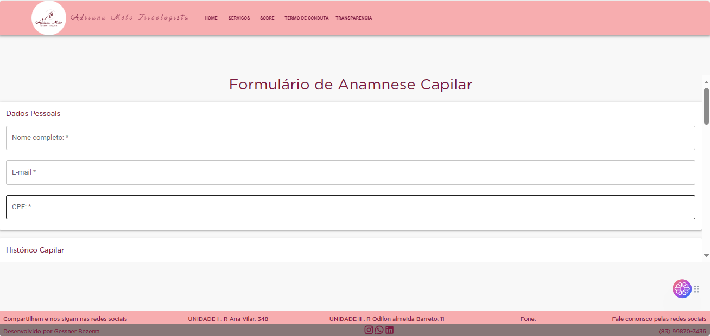
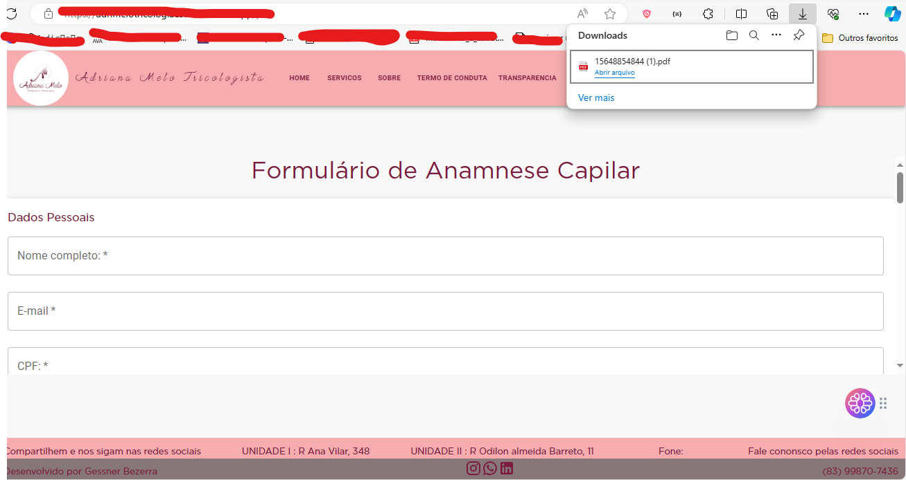

# Projeto Adrimelotricologia

## Descrição

O projeto Adrimelotricologia é um site para clínicas com portfólio e serviço de pré-consulta através de formulário, incluindo a geração automática de PDF. O site conta com imagens interativas, header com logo, título, menus e navBar de navegação, botão de acesso ao formulário de pré-consulta, e um footer expansível com dados de contato, incluindo ícones das principais redes sociais. As imagens no portfólio e na página inicial reagem ao movimento do mouse, proporcionando uma experiência interativa ao usuário.

---

## Etapas de Instalação

```bash
npm install

```

---

# Instruções de Uso

As imagens na página inicial e no portfólio estão localizadas no diretório `./public/assets/section` na aplicação, elas reagem dinamicamente ao movimento do mouse, proporcionando uma experiência interativa ao usuário.

O formulário pode ser acessado clicando no botão no header.

Os campos do formulário possuem propriedades de preenchimento obrigatório.

O campo CPF aceita apenas números, com no máximo 11 dígitos, e possui formatação para garantir a validação correta do número.

Se algum campo for deixado em branco, ao clicar no botão no final do formulário, um modal será exibido, alertando sobre a obrigatoriedade dos dados. O modal pode ser fechado clicando no botão contido nele.

Preencha todos os campos do formulário e clique no botão no final para salvar as informações. Após o salvamento, um novo botão aparecerá ao lado do botão de salvar, permitindo a geração do arquivo PDF.

Ao clicar no botão de gerar o PDF, a página do formulário será renderizada, e o arquivo PDF será gerado e baixado automaticamente no computador do usuário.

O arquivo PDF terá um nome pré-definido, utilizando o CPF informado pelo usuário no formulário, seguido de ponto e a extensão 'pdf'.

O arquivo PDF gerado pode ser enviado para o proprietário do site usando o ícone do WhatsApp, disponível no footer.

---

## Telas da Aplicação

##### Pagina HOME

<div style="display: flex; justify-content: space-between;">
  
  
  
</div>

---

##### LOADING

<div style="display: flex; justify-content: center;">
  
</div>

---

##### Pagina SERVIÇOS

<div style="display: flex; justify-content: center;">
  
</div>

---

##### Pagina SOBRE

<div style="display: flex; justify-content: center;">
  
</div>

---

##### Pagina TERMOS DE SERVIÇOS

<div style="display: flex; justify-content: center;">
  
</div>

---

##### Pagina POLÍTICA DE TRANSPARÊNCIA

<div style="display: flex; justify-content: center;">
  
</div>

---

##### HEADER

<div style="display: flex; justify-content: center;">
  
</div>

---

##### Pagina PDF

<div style="display: flex; justify-content: center;">
  
  
  
</div>

---

##### MODAL DE ALERTA

<div style="display: flex; justify-content: center;">
  
</div>

---

##### BOTÃO SALVAR DADOS

<div style="display: flex; justify-content: center;">
  
</div>

---

##### BOTÃO GERAR ARQUIVO EM PDF

<div style="display: flex; justify-content: center;">
  
</div>

---

##### ALERTA DE PDF GERADO

<div style="display: flex; justify-content: center;">
  
</div>

---

# Processo de Contribuição

O projeto é privado e no momento não está aberto para colaboradores.

---

# Termos de Serviço

---

# Autores e Colaboradores

-   Gessner Bezerra

---

# Status do Projeto

Em andamento

---

# Contato

-   E-mail: [gessnerbezerra@gmail.com](mailto:gessnerbezerra@gmail.com)
-   Telefone: (83) 99870-7436
-   WhatsApp: [+5583998707436](https://wa.me/5583998707436)

```

Lembre-se de substituir `URL_DA_IMAGEM_TELA_INICIAL`, `URL_DA_IMAGEM_PORTFOLIO` e `URL_DOS_SEUS_TERMOS_DE_SERVICO` pelas URLs reais das imagens e dos Termos de Serviço. Se precisar de mais alguma coisa ou ajustes, estou à disposição!

```
